# Mealio

Photo-first meal tracking app. Snap a photo, log your meal, track your nutrition.

## Features

- **Photo-first capture** — Camera as the primary action; log a meal in seconds
- **Nutrition tracking** — Calories, macros, and ingredients per meal
- **Visual diary** — Week-based calendar with meal photo cards
- **Statistics** — Nutrition trends, meal type distribution, top ingredients
- **Location tagging** — Attach locations to meals with map view
- **Search & filter** — Find meals by keyword, meal type, or date range
- **Guest mode** — Use the app without an account (MMKV local storage, up to 10 entries)
- **Bilingual** — English and Korean

## Architecture

Monorepo with three packages:

```
mealio/
├── mobile/       React Native 0.83 / Expo 55
├── api/          Rust / Axum 0.8
├── infra/        Pulumi (GCP, Cloudflare, Neon)
└── diagrams/     D2 architecture & infrastructure diagrams
```

### Infrastructure

<picture>
  <source media="(prefers-color-scheme: dark)" srcset="./diagrams/infrastructure-simplified-dark.svg">
  <source media="(prefers-color-scheme: light)" srcset="./diagrams/infrastructure-simplified-light.svg">
  
</picture>

### System Architecture

<picture>
  <source media="(prefers-color-scheme: dark)" srcset="./diagrams/architecture-simplified-dark.svg">
  <source media="(prefers-color-scheme: light)" srcset="./diagrams/architecture-simplified-light.svg">
  
</picture>

[More diagrams →](./diagrams/README.md)

## Tech Stack

### Mobile

| Category | Technology |
|---|---|
| Framework | React Native 0.83, Expo 55 |
| Language | TypeScript 5.9 |
| Navigation | Expo Router (file-based, typed routes) |
| State | Zustand 5 (client), TanStack Query 5 (server), MMKV 4 (persistence) |
| Forms | TanStack Form + Zod 4 |
| UI | Reanimated 4, FlashList, expo-image |
| Auth | Google Sign-In, Apple Authentication |
| Camera | expo-camera, expo-image-picker |
| Maps | react-native-maps, expo-location |
| i18n | i18next + react-i18next (en, ko) |
| Testing | Jest 30, Testing Library |
| Monitoring | Sentry |

### API

| Category | Technology |
|---|---|
| Framework | Axum 0.8 |
| Language | Rust (2021 edition) |
| Database | PostgreSQL 18 (Neon) |
| Queries | SQLx 0.8 (compile-time checked) |
| Auth | JWT + JWKS (Google & Apple OAuth) |
| Storage | Cloudflare R2 (S3-compatible, presigned URL uploads) |
| Docs | OpenAPI via utoipa + Swagger UI |
| Rate Limiting | tower_governor (10/min auth, 60/min global) |
| Monitoring | Sentry, tracing |

### Infrastructure

| Service | Provider |
|---|---|
| Database | Neon (PostgreSQL) |
| API Hosting | GCP Cloud Run (us-east4, scales 0–3) |
| Object Storage | Cloudflare R2 |
| Email | Cloudflare Email Routing |
| Error Tracking | Sentry |
| Analytics | PostHog |
| Mobile Builds | EAS (Expo Application Services) |
| IaC | Pulumi (GCP, Cloudflare, Neon) |

## Getting Started

### Prerequisites

- [Bun](https://bun.sh/) — mobile package management
- [Rust](https://rustup.rs/) — API
- [Docker](https://www.docker.com/) — local PostgreSQL
- iOS Simulator (Xcode) or Android Emulator

### API

```bash
cd api
cp .env.example .env     # configure environment variables
docker compose up -d     # start local PostgreSQL
cargo run                # dev server on port 8080
```

Swagger UI at `http://localhost:8080/swagger-ui`.

### Mobile

```bash
cd mobile
bun install
bun start                # Expo dev server
bun run ios              # iOS simulator
bun run android          # Android emulator
```

## Project Structure

### Mobile — Feature-Sliced Design

```
mobile/src/
├── app/                 # Providers, global config
├── widgets/             # entry-grid, recent-entries
├── features/
│   ├── auth/            # Google & Apple sign-in
│   ├── capture-meal/    # Camera capture & meal form
│   ├── entry-feed/      # Diary calendar & feed
│   ├── entry-detail/    # View/edit entry
│   ├── search-entries/  # Search & filter
│   └── settings/        # User preferences
├── entities/
│   ├── entry/           # Entry CRUD, upload queue, photos, nutrition, statistics
│   ├── meal/            # Meal type definitions
│   └── user/            # User profile
└── shared/
    ├── api/             # HTTP client (auto token refresh, retry on 401)
    ├── lib/             # Auth, i18n, storage, deeplink, location, utils
    ├── ui/              # Design system (tokens, themes, styled + headless components)
    ├── config/          # Constants, query keys, feature flags
    └── types/           # Shared TypeScript types
```

Import rules: `app → widgets → features → entities → shared` (no upward imports).

**Dual-mode architecture**: authenticated users get API + TanStack Query; guests get MMKV local storage + Zustand. The `useEntryData` hook abstracts the difference.

### API

```
api/src/
├── main.rs              # Server bootstrap, middleware, routes
├── lib.rs               # AppState (PgPool, JWT, OAuth, S3/R2)
├── error.rs             # RFC 9457 Problem Details
├── extractors.rs        # Db, AuthUser, Claims
├── response.rs          # Created<T>, Ok<T>, NoContent
├── features/
│   ├── auth/            # OAuth (Google, Apple), JWT, JWKS caching
│   ├── users/           # Profile, settings
│   ├── diary/           # Meal entries with location
│   ├── photos/          # Entry photos
│   ├── uploads/         # Presigned URL generation for R2
│   ├── nutrition/       # Nutrition overrides
│   ├── ai_analyses/     # AI meal analysis (stub)
│   ├── ingredients/     # Ingredient master list & linking
│   └── statistics/      # Aggregated stats
├── shared/              # Cross-feature utilities
└── migrations/          # SQL migrations (0001–0009)
```

Each feature follows: `mod.rs`, `router.rs`, `handlers.rs`, `models.rs`.

## API Endpoints

All routes prefixed with `/api/v1`. Migrations run automatically on startup.

| Group | Endpoints |
|---|---|
| Auth | `POST /auth/sign-in`, `/auth/refresh`, `/auth/revoke` |
| Users | `GET/PATCH/DELETE /users/me`, `GET/PATCH /users/me/settings` |
| Diary | `GET/POST /diary`, `GET/PATCH/DELETE /diary/{id}` |
| Location | `GET/PUT/DELETE /diary/{id}/location` |
| Photos | `GET/POST /diary/{id}/photos`, `PATCH/DELETE /diary/{id}/photos/{id}`, `POST .../primary` |
| Nutrition | `GET/PUT/DELETE /diary/{id}/nutrition` |
| AI Analysis | `GET/POST /diary/{id}/analysis` (stub — 501) |
| Ingredients | `GET/POST /ingredients`, `GET/POST/PUT /diary/{id}/ingredients`, `DELETE .../ingredients/{id}` |
| Statistics | `GET /statistics/nutrition`, `/meal-types`, `/top-ingredients`, `/overview` |
| Uploads | `POST /uploads/presign` |
| Health | `GET /health` |

## Testing

### Mobile

```bash
cd mobile
bun test                             # all tests (38 suites, 1059 tests)
bun test -- --testPathPattern=auth   # tests matching "auth"
bun test -- --watch                  # watch mode
```

### API

```bash
cd api
cargo test               # all tests
cargo test error         # tests matching "error"
```

## CI/CD

| Workflow | Trigger | Action |
|---|---|---|
| `api.yml` | Push/PR to `main` with `api/**` changes | Build + test, then deploy to Cloud Run on push |
| `mobile-ci.yml` | PR to `main` with `mobile/**` changes | Lint + test |
| `mobile-build.yml` | Manual dispatch | EAS build + optional store submit |
| `mobile-ota.yml` | Push to `main` with `mobile/**` changes | Test, then `eas update` OTA |

## Environment Variables

### API (`api/.env`)

| Variable | Description |
|---|---|
| `DATABASE_URL` | PostgreSQL connection string |
| `JWT_SECRET` | JWT signing key |
| `GOOGLE_CLIENT_ID` | Google OAuth client ID |
| `APPLE_TEAM_ID` | Apple Developer Team ID |
| `APPLE_BUNDLE_ID` | iOS bundle identifier |
| `R2_ACCOUNT_ID` | Cloudflare R2 account |
| `R2_ACCESS_KEY_ID` | R2 access key |
| `R2_SECRET_ACCESS_KEY` | R2 secret key |
| `R2_BUCKET_NAME` | R2 bucket name |
| `R2_PUBLIC_URL` | R2 public URL |
| `CORS_ORIGINS` | Allowed CORS origins |
| `SENTRY_DSN` | Sentry error tracking DSN |

### Mobile (`mobile/.env`)

| Variable | Description |
|---|---|
| `GOOGLE_MAP_API_KEY` | Google Maps API key |
| `EXPO_PUBLIC_GOOGLE_WEB_CLIENT_ID` | Google OAuth web client ID |
| `EXPO_PUBLIC_GOOGLE_IOS_CLIENT_ID` | Google OAuth iOS client ID |
| `EXPO_PUBLIC_SENTRY_DSN` | Sentry DSN |

## Deployment

- **API**: Multi-stage Docker build → GCP Cloud Run (us-east4, autoscaling 0–3, 1 CPU / 512 MB)
- **Mobile**: EAS Build → App Store / Play Store; OTA updates via `eas update`
- **Database**: Neon (managed PostgreSQL)
- **Storage**: Cloudflare R2 (direct upload via presigned URLs)
- **IaC**: Pulumi manages Cloud Run, Secret Manager, Artifact Registry, R2, Neon

## License

Private. All rights reserved.
